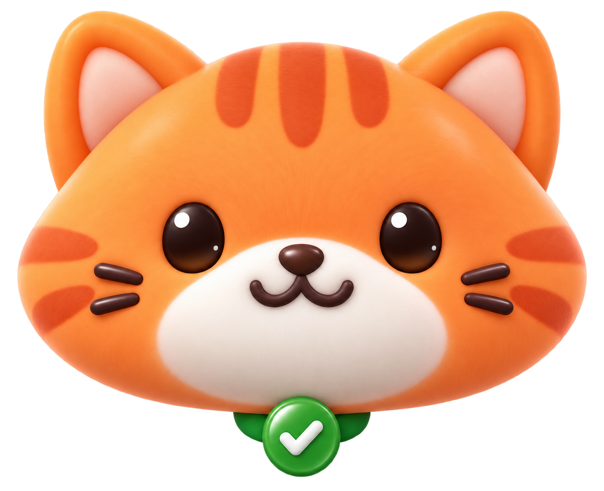
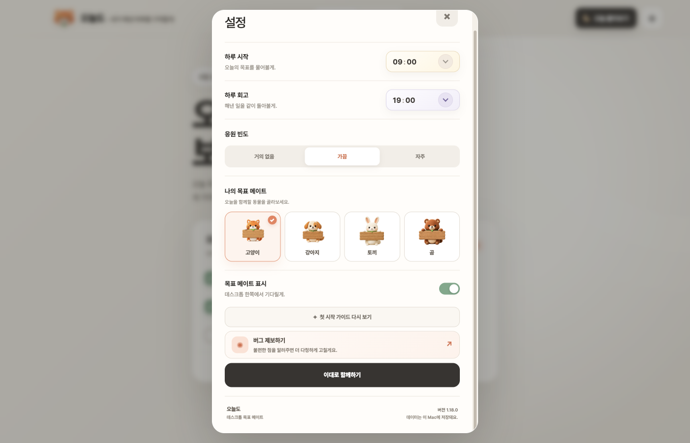
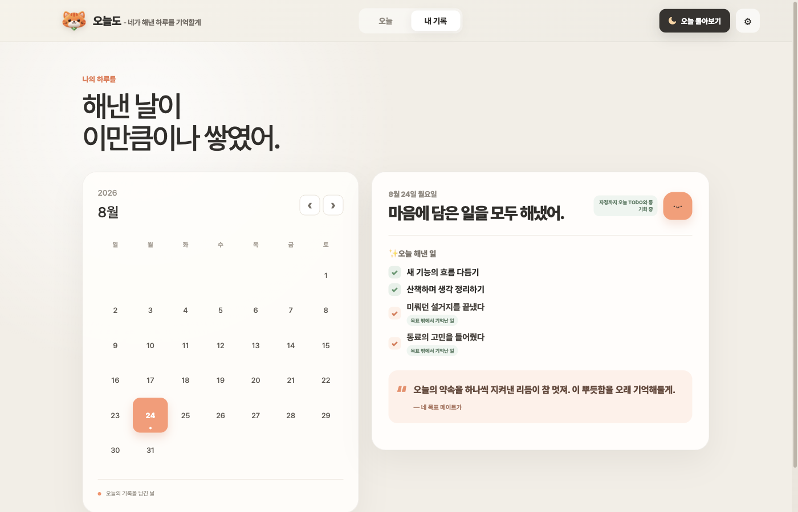

<p align="center">
  
</p>

<h1 align="center">오늘도</h1>

<p align="center">
  <strong>네가 해낸 하루를 기억해주는 macOS 데스크톱 목표 메이트</strong><br />
  못한 일보다 오늘 분명히 해낸 일을 먼저 바라봅니다.
</p>

<p align="center">
  <a href="https://github.com/noeyhoj/oneuldo/releases/latest">다운로드</a> ·
  <a href="#주요-기능">주요 기능</a> ·
  <a href="#직접-실행하기">직접 실행하기</a>
</p>


## 오늘도가 추구하는 것

하루를 계획대로 보내지 못했다는 이유로, 이미 해낸 일까지 작아 보일 때가 있습니다. 오늘도는 목표를 더 강하게 독촉하는 앱이 아니라 **내가 움직인 만큼을 놓치지 않고 기억하게 돕는 앱**입니다.

- 목표는 부담스럽지 않게, 오늘 꼭 해내고 싶은 일만 적습니다.
- 회고는 평가가 아니라 발견에 가깝게 만듭니다.
- 목표에 없었던 작은 행동도 오늘의 성취로 남깁니다.
- 미룬 일은 실패가 아니라 다음 날 다시 선택할 수 있는 항목으로 다룹니다.
- 응원은 방해하지 않으면서도 필요할 때 곁에 남습니다.

## 주요 기능

### 오늘의 목표

- 하루에 최대 다섯 가지 목표 기록
- 메뉴 막대에서 목표 확인 및 완료 처리
- 설정한 시작 시간 이후 목표가 비어 있으면 상태 점으로 안내
- 회고 후 TODO가 바뀌어도 자정까지 오늘 기록과 자동 동기화

### 카드형 하루 회고

- `오늘 해낸 일`과 `오늘 하기 어려웠던 일`을 카드로 한 장씩 확인
- 어려웠던 일은 왼쪽으로 넘겨 그만하기, 오른쪽으로 넘겨 내일 이어하기
- 내일로 보낸 항목은 다음 날 자동으로 채우지 않고 사용자가 다시 선택
- 회고 마지막에 목표 밖에서 해낸 일이 더 있는지 한 번 더 질문

### 목표 메이트

- 고양이, 강아지, 토끼, 곰 캐릭터 선택
- 데스크톱 위에서 드래그해 원하는 위치로 이동
- 주기적으로 나타났다 사라지는 말풍선
- 가끔 실제 목표명을 언급하는 상황별 응원
- 캐릭터 클릭 시 직전 문장을 반복하지 않는 다양한 대사

### 기록과 메뉴 막대

- 캘린더에서 날짜별 성취와 회고 확인
- 목표 밖에서 기억난 일은 별도 표시
- 목표 미작성과 회고 대기 상태를 메뉴 막대 아이콘의 서로 다른 점으로 표시
- 앱을 열지 않고도 메뉴 막대에서 오늘 화면, 회고, 기록, 설정으로 이동
- 설정의 `버그 제보하기`에서 GitHub 제보 양식으로 바로 이동

## 화면

<table>
  <tr>
    <td width="50%"></td>
    <td width="50%"></td>
  </tr>
  <tr>
    <td align="center"><strong>목표 밖의 성취도 기록</strong></td>
    <td align="center"><strong>메이트 선택과 쉬운 버그 제보</strong></td>
  </tr>
</table>



<p align="center"><strong>다정하게 쌓이는 하루 기록</strong></p>

<p align="center">
  <br />
  <strong>필요한 순간만 다정하게 말을 건네는 목표 메이트</strong>
</p>

## 다운로드

현재 배포판은 **Apple Silicon 기반 Mac**을 지원합니다.

1. [GitHub Releases](https://github.com/noeyhoj/oneuldo/releases/latest)에서 최신 `Oneuldo-*-arm64.dmg`를 내려받습니다.
2. DMG를 열고 `오늘도`를 `Applications` 폴더로 옮깁니다.
3. 처음 실행할 때 macOS가 개발자 확인 안내를 표시하면 Finder에서 앱을 우클릭한 뒤 `열기`를 선택합니다.

> 현재 개인 배포판은 Apple Developer 서명을 포함하지 않습니다. 앱의 목표·설정·회고 데이터는 외부 서버가 아닌 이 Mac의 로컬 저장소에 보관됩니다.

## 직접 실행하기

### 요구 사항

- macOS
- Node.js 22.13 이상
- npm

```bash
git clone https://github.com/noeyhoj/oneuldo.git
cd oneuldo
npm install
npm run desktop
```

배포용 DMG와 ZIP을 만들려면 다음 명령을 실행합니다.

```bash
npm run desktop:dist
```

검증 명령은 다음과 같습니다.

```bash
npm run lint
npm test
```

## 기술 구성

- Electron
- React 19
- TypeScript
- Vite / vinext
- macOS 네이티브 메뉴 막대 보조 앱(Swift)
- Pretendard Variable

## 데이터와 개인정보

오늘도는 계정 가입을 요구하지 않습니다. 목표, 설정, 회고 기록과 캐릭터 위치는 사용자의 Mac에 저장됩니다. 앱을 삭제하더라도 데이터가 남을 수 있으며, 완전히 초기화하려면 macOS의 `Application Support/oneuldo` 데이터를 함께 삭제해야 합니다.

## 기여

버그 제보와 기능 제안은 [Issues](https://github.com/noeyhoj/oneuldo/issues)에서 받을 수 있습니다. 변경을 제안할 때는 사용자에게 압박을 더하지 않는지, 해낸 일을 더 잘 발견하게 돕는지를 함께 살펴봐 주세요.
